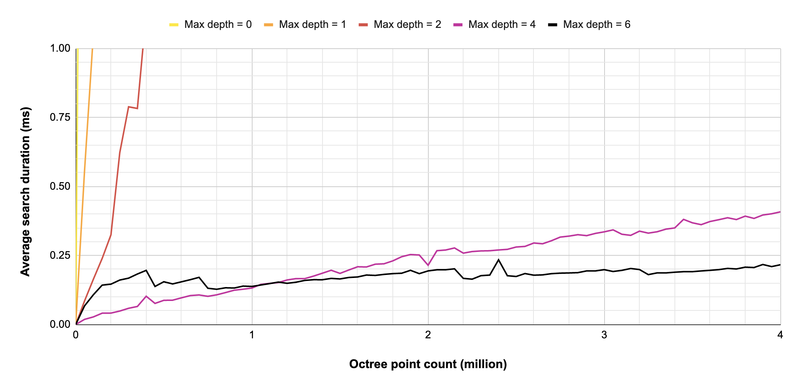

# octree-cpp

_Linus Schaub, 2022_

Simple octree data structure to store and find 3D points.

We use the three classes [Octree](src/octree.cpp), [Axis-Aligned-Bounding-Box (AABB)](src/aabb.cpp) and [Point](src/point.cpp)

## Features

### Insertion of points

To insert a point, the insert method can be used: `insert`. It takes a pointer to a point and will add the point to the octree.

### Finding points

To determine if a given point is already in the octree, the `find` method can be used. It will return a boolean to show if a point with the same position was found.

### Nearest neighbor search

The nearest neighbor to a given point can be found with the `find_closest` method. If no point was found (the octree is empty), `nullptr` will be returned. To determine the distance of a given point `p` and the found nearest point `f` can be determined with this line:

```
Point *p = new Point(2.5, 1, 10);
Point *f = octree.find_closest(p);
float distance = (*p - *f).length();
```

### Maximum octree depth

A maximum depth setting allows the octree to limit its depth. This will be helpful if points are very close together. If the maximum depth is reached, the points will be stored together in the deepest octree node. As shown in the performance section, the depth limit greatly influences the search performance.

## Usage

- `cd build`
- `cmake ..`
- `make`
- `./octree-cpp`

## Performance

The search performance was evaluated at different maximum octree depths. At each test, 100 points were searched and the duration was averaged. The plot below shows the average search duration by octree point count and maximum depth setting.

